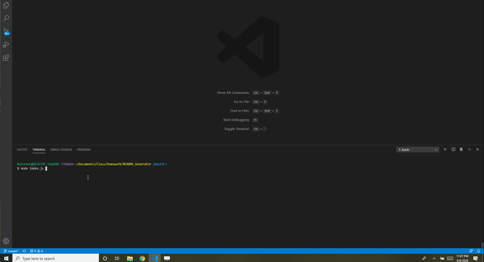

###### Badges

# README_Generator
###### Description

Using Node.js this app creates clean, professional README's easily and quickly from user inputs in the command line.  This app exists to save time for the developer to focus more attention on the application.

# Generating a README.md

## Table of Contents (Optional)
* [Top of Page](#badges)
* [Gif](#description)
* [Installation](#installation)
* [Usage](#usage)
* [Credits](#credits)
* [License](#license)
* [Contributing](#contributing)
* [Tests](#tests)
* [Contacts](#contacts)

## Installation
1. Clone or Download
2. This app requires you link to a personal access token to your github allowing access to your user email address [TokenInstructions](https://help.github.com/en/github/authenticating-to-github/creating-a-personal-access-token-for-the-command-line)
3. On navigation to correct file install packages npm i
4. Done. Time to use it.

## Usage 
1. From command line type node index.js
2. Follow the prompts as requested

## Credits

List your collaborators, if any, with links to their GitHub profiles.

If you used any third-party assets that require attribution, list the creators with links to their primary web presence in this section.

If you followed tutorials, include links to those here as well.

## License
This project is licensed under The MIT License (MIT).

## Contributing
All contributions and suggestions are welcome! For direct contributions, please fork the repository and file a pull request.

## Tests
1. Validate that you have installed are the correct packages:
* inquirer
2. Validate that you have linked correctly to your .env file containing your github token
* [GitHub_Token](https://help.github.com/en/github/authenticating-to-github/creating-a-personal-access-token-for-the-command-line)
* [dotenv](https://www.npmjs.com/package/dotenv)

## Contacts

* Name: Matt Turner (@mwturner611)
* e-mail: mwturner611@gmail.com
* [LinkedIn](https://www.linkedin.com/in/matt-turner-ba328211a/)

